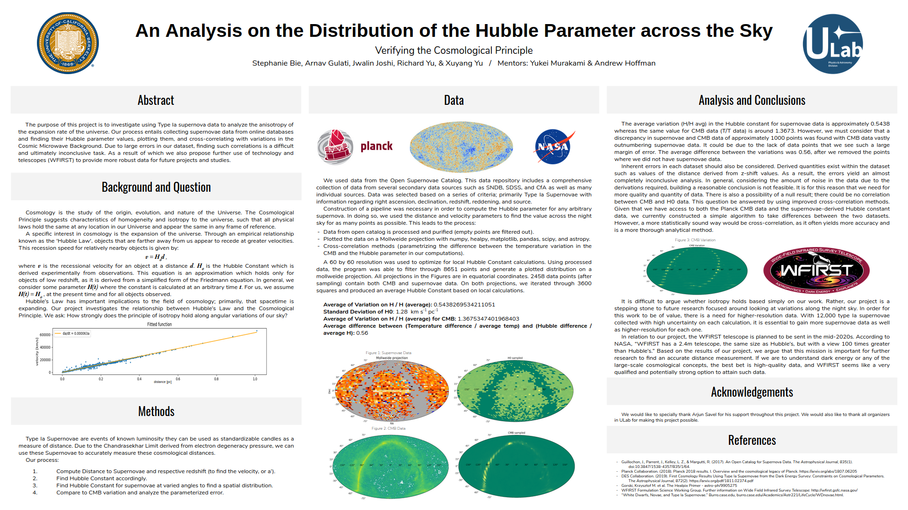

# ULAB 2018 garage
This git repository is created to store and share codes created for ULAB 2018 cosmology group. 

For requests and questions, contact ULAB: info@ulab.berkeley.edu

All code and data are free to use at your own responsibility.

---------

---------
### Contents:
- 'Hubble_Plot.py': ULAB workshop for hubble diagram.
- 'The Open Supernova Catalog.csv': data for Hubble_Plot.py
- 'readme.md': this file
- 'Hubble_Plot_output.txt': copy of output from Hubble_Plot.py
- 'raw_data.png': raw data plot (blue and orange)
- 'picked_data.png': picked data plot (blue only)
- 'fitted_H.png': plot of fitted line and picked data
